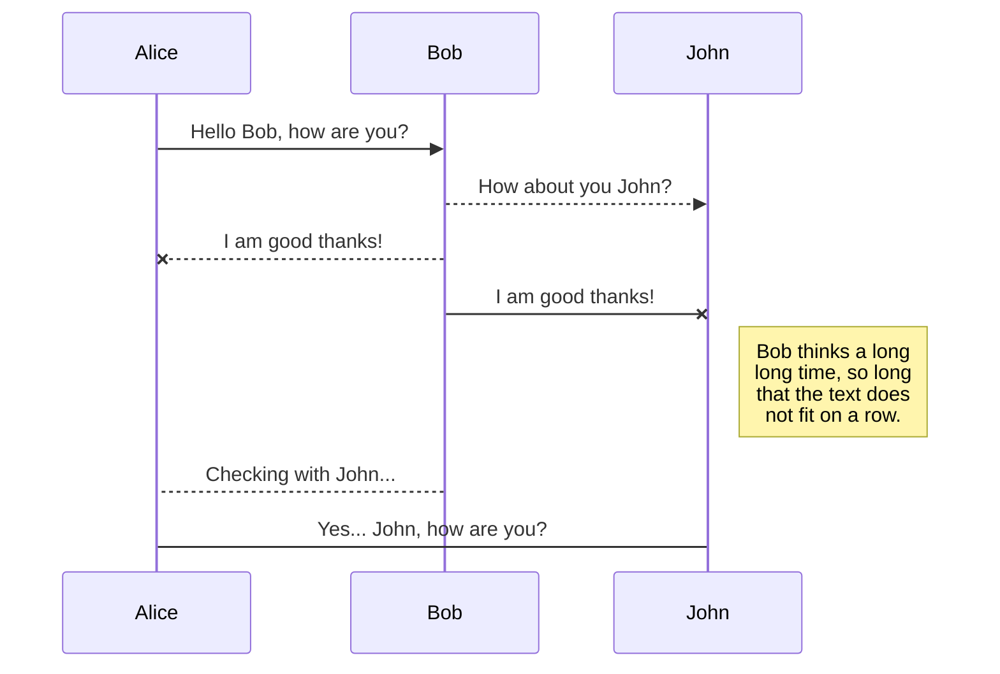
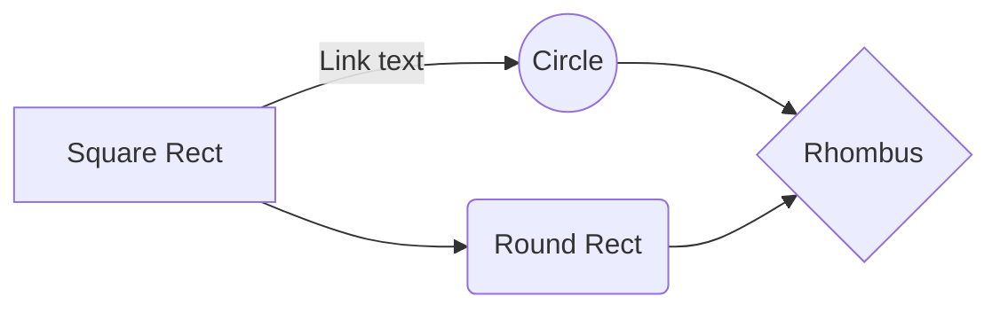

# Welcome to [Flash Cards](https://andersontoma92wdptoct2022.github.io/Flashcard/)

## Motivation

As part of Ironhack course, this is our first deliverable project!

We were assigned to work in pair and deliver a game in 4 days.

One of the creators studies Japanese and the game serves to memorize the thousands of ideograms in the language.

## Technical Requirements

1.  Render a game in the browser.
2.  Have logic for winning and/or losing  and show feedback to the player in either case.
3.  Include  separate HTML / CSS / JavaScript.
4.  Use  plain JavaScript  for DOM manipulation (or HTML canvas for graphics).
5.  Have a repo on GitHub.
6.  Have at least  1 commit per day  that you worked on it.
7.  Be deployed online  using GitHub Pages so that anybody can play it.
8.  Stick with  KISS (Keep It Simple Stupid)  and  DRY (Don’t Repeat Yourself)  principles.

## Project Presentation
Presentation: [link](https://prezi.com/view/jgEASrvRetGEvy7MXios/)
The game aims at training and memorization of Chinese/Japanese characters.

To start:
 - Select the ideogram level and amount of rounds;
 - There are rounds of 10, 15 and 20 with 2 , 3 , 4 lives, respectively; 
 - The game starts with a ideogram(kanji) and you must select the option that represents its meaning;
 
 Winning condition:
- You must complete the rounds without losing all of your lives.

## What We Used & Learned

The kanji data being used was downloaded from this repository: [davidluzgouveia/kanji-data](https://github.com/davidluzgouveia/kanji-data).
We lerned how 

## Personal Information

The file explorer is accessible using the button in left corner of the navigation bar. You can create a new file by clicking the **New file** button in the file explorer. You can also create folders by clicking the **New folder** button.

## UML diagrams

You can render UML diagrams using [Mermaid](https://mermaidjs.github.io/). For example, this will produce a sequence diagram:

And this will produce a flow chart:

